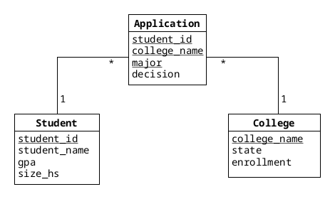

# EDAF75, project report

This is the report for

 + Firstname Lastname, `stil_id`
 + ...

We solved this project on our own, except for:

 + The Peer-review meeting
 + ... describe any other help you've gotten ...


## ER-design

The model is in the file [`er-model.png`](er-model.png):

<center>
    
</center>

(The image above describes the model for our student application
example, you must obviously replace the file '`er-model.png`' with an
image of your own ER-model...).


## Tables

The ER-model above gives the following tables (including keys and
foreign keys):

```text
table students:
  student_id
  student_name
  gpa
  size_hs
  PK: student_id

table colleges:
  college_name
  state
  enrollment
  PK: college_name

table applications:
  student_id
  college_name
  major
  decision
  PK: student_id, college_name, major
  FK: student_id -> students(student_id)
  FK: college_name -> colleges(college_name)
```

(this should be replaced with your own tables, of course, but use the
format above for the primary keys and foreign keys).


## Scripts to set up database

The scripts used to set up and populate the database are in:

 + [`create-schema.sql`](create-schema.sql) (defines the tables), and
 + [`initial-data.sql`](initial-data.sql) (inserts data).

So, to create and initialize the database, we run:

```shell
sqlite3 krusty-db.sqlite < create-schema.sql
sqlite3 krusty-db.sqlite < initial-data.sql
```

(or whatever you call your database file).

## How to compile and run the program

This section should give a few simple commands to type to
compile and run the program from the command line, such as:

```shell
python app.py
```

or

```shell
./gradlew run
```
